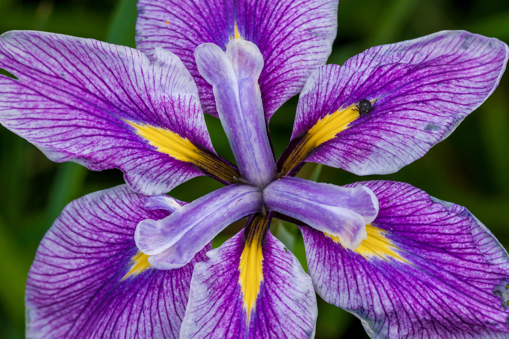

<article class="markdown-body entry-content container-lg" itemprop="text"><h1><a id="user-content-machine-learning-project--iris-flower-classification" class="anchor" aria-hidden="true" href="#machine-learning-project--iris-flower-classification"><svg class="octicon octicon-link" viewBox="0 0 16 16" version="1.1" width="16" height="16" aria-hidden="true"><path fill-rule="evenodd" d="M7.775 3.275a.75.75 0 001.06 1.06l1.25-1.25a2 2 0 112.83 2.83l-2.5 2.5a2 2 0 01-2.83 0 .75.75 0 00-1.06 1.06 3.5 3.5 0 004.95 0l2.5-2.5a3.5 3.5 0 00-4.95-4.95l-1.25 1.25zm-4.69 9.64a2 2 0 010-2.83l2.5-2.5a2 2 0 012.83 0 .75.75 0 001.06-1.06 3.5 3.5 0 00-4.95 0l-2.5 2.5a3.5 3.5 0 004.95 4.95l1.25-1.25a.75.75 0 00-1.06-1.06l-1.25 1.25a2 2 0 01-2.83 0z"></path></svg></a>Machine Learning Project : Iris-flower-classification</h1>
  

Photo by <a href="https://unsplash.com/@zmachacek?utm_source=unsplash&amp;utm_medium=referral&amp;utm_content=creditCopyText">Zdeněk Macháček</a> on <a href="https://unsplash.com/s/photos/iris-flower?utm_source=unsplash&amp;utm_medium=referral&amp;utm_content=creditCopyText">Unsplash</a>

This program applies basic machine learning (classification) concepts on <em>Fisher's Iris Data</em> to predict the species of a new sample of Iris flower.

<strong>Software and Libraries</strong>

<ul>
<li>Python 3.6.0</li>
<li>Anaconda 4.3.0 (32 bit)</li>
<li>scikit-learn 0.18.1</li>
</ul>

<strong>Introduction</strong> 
The dataset for this project originates from the <a href="https://archive.ics.uci.edu/ml/datasets/Iris" rel="nofollow">UCI Machine Learning Repository</a>. The Iris flower data set or Fisher's Iris data set is a multivariate data set introduced by the British statistician and biologist Ronald Fisher in his 1936 paper The use of multiple measurements in taxonomic problems as an example of linear discriminant analysis.

<ul>
<li>The data set consists of 50 samples from each of three species of Iris (Iris setosa, Iris virginica and Iris versicolor).</li>
<li>Four features were measured from each sample (in centimetres):
<ul>
<li>Length of the sepals</li>
<li>Width of the sepals</li>
<li>Length of the petals</li>
<li>Width of the petals</li>
</ul>
</li>
</ul>
</ul>
</article>

